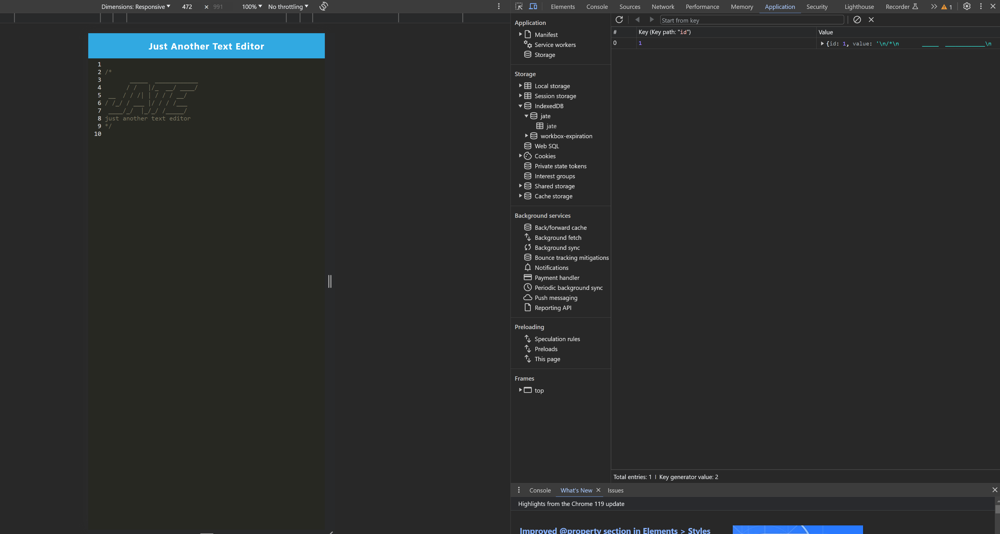

# PWA_Text_Editor

## Table of Contents

- [Description](#description)
- [Installation](#installation)
- [Usage](#usage)
- [License](#license)
- [Contributing](#contributing)
- [Tests](#tests)
- [Questions](#questions)

## Description

This project aims to create a Progressive Web Application (PWA) in the form of a text editor. It's designed for developers to jot down notes or code without disrupting their main projects. The development of this application enhanced my understanding of service workers.

## Installation

To install, right-click on the root repository folder and open a new integrated terminal. Execute the following command to set up your node modules:

```bash
npm run install
```

## Usage

To use this project locally, in your root folder integrated terminal, type the following commands:

```bash
npm run build

npm run start:dev
```

website live version:

To verify correct operation, right-click on the page and select "Inspect". Navigate to the Applications tab. Under Manifest, you should see a page resembling:


To check the service worker, select the Service Worker tab, which should display:


For database verification, go to IndexedDB > jate. Your database should appear like:



This page also allows installation as a PWA by clicking the "Install!" button. The installed application looks like:


## License


This project is licensed under the terms of the **[MIT License](https://opensource.org/licenses/MIT)**

## Contributing

N/A

## Tests

N/A

## Questions

For any questions, please contact me:

- GitHub: [@rodrigo0599](https://github.com/rodrigo0599)
- Email: rodrigo0599@hotmail.com
